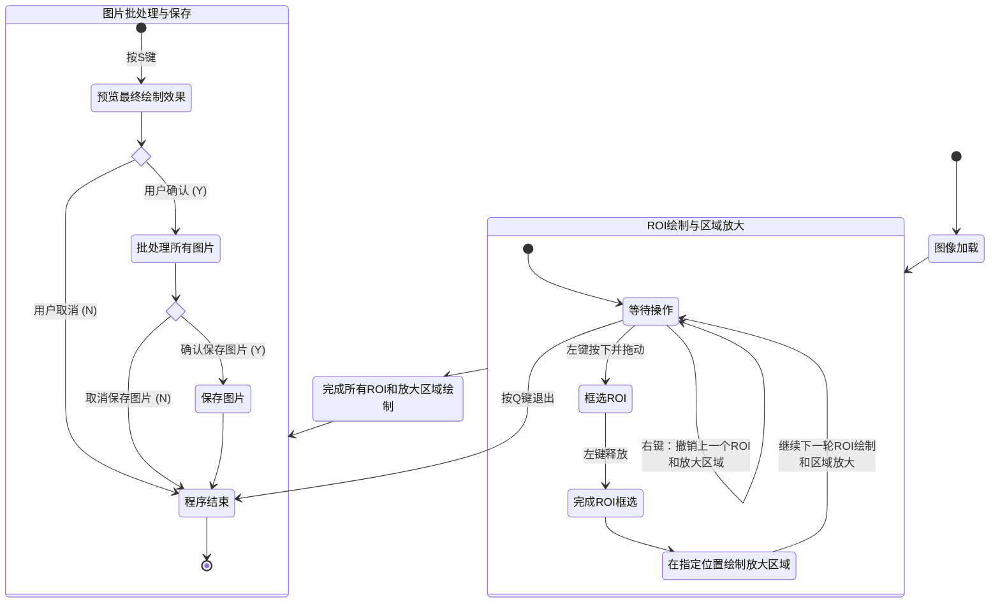
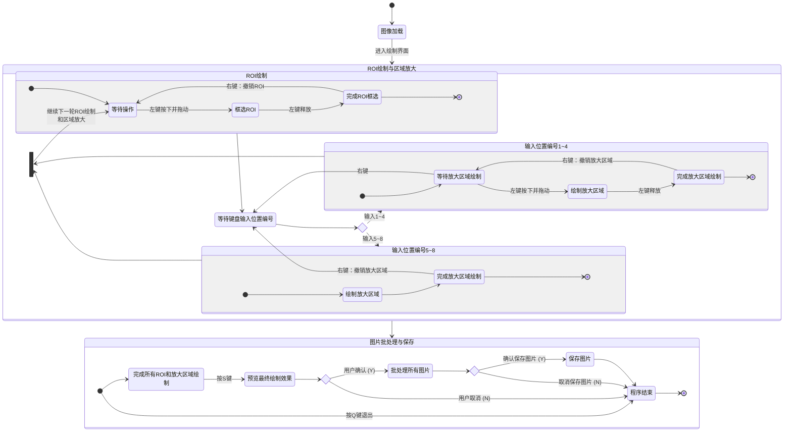
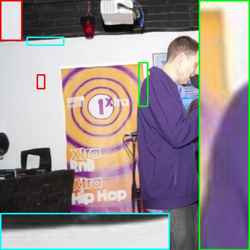
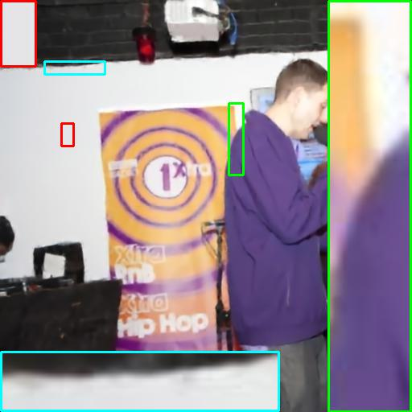

# Batch-MultiROI-Interactive-Zoom-Tool：一个可批量处理多张科研图像中的多个局部区域（ROI）的交互式放大工具。

## 📋 项目简介

此项目专为科研论文与技术报告中的插图处理而设计，能够高效、便捷地生成带有局部区域（**ROI**）放大效果的图片。用户可通过交互式界面，为单张或批量图片中的任意关键细节区域（ROI）设置放大效果，并智能布局于图片的指定位置，最终输出适合科研任务的专业图片。

> 本工具包含两个核心版本，均支持**对文件夹内所有图片进行批量处理**，图片数量无限制：
> - **[ROI_zoom.py](code/ROI_zoom.py)（预设参数版）**：通过代码预设放大区域的**位置、大小、颜色**，适合对输出效果有精确、统一要求的场景。
> - **[ROI_zoom2.py](code/ROI_zoom2.py)（交互增强版）**：**将放大区域的位置和大小设置完全交给鼠标键盘交互**，仅需预设**颜色**，操作更直观灵活。

---

## 📁 项目结构

<details open>
<summary><b>核心文件与目录</b></summary>

<br/>

```
Batch-MultiROI-Interactive-Zoom-Tool/
├── 📂 code/
│   ├── 📄 ROI_zoom.py              # 版本1：预设参数版
│   └── 📄 ROI_zoom2.py             # 版本2：交互增强版
├── 📂 demo/                    # 其他素材（含解说录屏）
├── 📂 状态图说明/                # 两个版本代码的状态图（含mermaid代码和一些其他说明）
├── 📂 示例图像/                 # 存放所有演示图片（含两个代码的输入和输出图片集）
├── 📂 视频说明/                 # 功能解说与演示视频
├── 📄 README.md                # 中文说明文档
└── 📄 README_en.md             # 英文说明文档
```

</details>

---

## ✨ 功能特点

-   🧩 **灵活的局部放大**：支持在单张图片上选择**任意数量**的感兴趣区域（ROI）进行放大，突破单点放大的限制。
-   ⚡  **高效的批量处理**：可一键处理指定文件夹内的**所有图片**，数量无限制，极大提升处理实验组图、对比图的效率。
-   🎮 **双版本工作流**：提供 **参数预设 (`ROI_zoom.py`)** 与 **全交互 (`ROI_zoom2.py`)** 两个版本，分别能满足“精确绘制”和“灵活与探索性”的需求。
-   🎨 **自定义边框样式**：支持为每个ROI框和放大区域框**自定义边框颜色**（通过BGR值列表配置），视觉对比鲜明，便于区分。
-   📐 **智能布局与保持比例**：**支持放大区域的8种预设位置（4角落（左上/左下/右上/右下）+4边界（上/下/左/右）），并自动维持原始ROI的宽高比，确保放大内容不变形。**
-   🖼️ **高质量输出**：默认采用**双线性插值**算法进行图像放大，**有效避免锯齿，确保放大后的局部细节清晰、平滑自然**。
-   🖱️ **直观的交互体验**：通过鼠标拖拽与键盘快捷键完成所有操作，并可实时预览与批量保存。

---

## 🔄 核心版本说明

两个版本共享**批量处理、多ROI支持、8种放大区域位置布局、宽高比锁定**等核心功能；最根本的区别在于**设置放大区域（位置、大小等）的方式**：

|     **特性维度**     |                                                       **`ROI_zoom.py`（预设参数版）**                                                       |                            **`ROI_zoom2.py`（交互增强版）**                             |
|:----------------:|:------------------------------------------------------------------------------------------------------------------------------------:|:--------------------------------------------------------------------------------:|
| **放大区域绘制方式** |                                                            **通过代码预设具体参数**                                                            |                                  **通过鼠标键盘实时绘制**                                  |
|     **核心配置**     | <div align="left">1. 需在代码中编辑`colormap`列表（**边框颜色**）<br>2. 编辑`preset_params` 列表，预设每个ROI的：<br>**位置代码** (1~8)、**相对大小** (如0.25)、**参考基准** (True：宽度，False：高度) </div>| 只需在代码中预设`colormap`（**边框颜色**）和`num_rois`（**ROI数目**） ，<br>**位置、大小等均在运行时通过界面交互决定**。 |
|     **人机交互**     |                                                            鼠标**框选ROI区域**。                                                            |           **全程交互：鼠标框选ROI区域 → 键盘数字键(1~8)选择放大位置 → 鼠标拖动调整放大区域尺寸(针对角落位置)**            |
|     **输出特征**     |                                                **确定性高**：所有图片的放大效果由预设参数严格定义，结果统一、可复现。                                                 |                       **灵活**：依赖用户实时交互，适合探索最佳布局，每次运行结果可能不同。                       |
|     **核心思想**     |                                                    **参数化、自动化**：一次配置，批量产出风格统一的图片。                                                     |                             **可视化、交互化**：边看边调，直接操控结果。                             |

### 📈 如何选择？
- **选`ROI_zoom.py`**：当您需要处理**大量相似图片**，且希望固定放大区域的**位置和比例**。
- **选`ROI_zoom2.py`**：当您需要处理**大量相似图片**，且希望**直观、灵活地控制放大效果**。

---

## 🔧 安装依赖

确保已安装Python，然后使用pip安装所需库：

```bash
pip install opencv-python numpy pillow
```

---

## 🚀 使用指南

### 1. 参数配置

<details open>
<summary><b>ROI_zoom.py（预设参数版）</b></summary>

<br/>

打开`ROI_zoom.py`，定位到文件底部的 `if __name__ == "__main__":` 部分，修改以下配置：

```python
input_folder = r"F:\你的输入图片文件夹路径" # 输入图片文件夹
output_folder = r"F:\你的输出图片文件夹路径" # 输出图片文件夹
is_saved = True  # 是否保存结果

# 颜色列表 (B, G, R)，按顺序为每个ROI框指定颜色（放大区域数少于5则取前几个颜色；多于则循环（0号~4号））
colormap = [(255, 255, 0), (0, 255, 0), (0, 0, 255),
        (255, 0, 0), (255, 0, 255)]

# 【核心】预设参数列表：每个元组定义一套ROI放大规则
# 格式: (位置代码, 相对大小, 尺寸是否参考宽度)
# 位置代码: 1=左上, 2=右上, 3=左下, 4=右下, 5=上边界, 6=下边界, 7=左边界, 8=右边界
preset_params = [
    (1, 0.25, True),  # 第1个ROI：放在左上角，大小为原图宽度的25%
    (6, 1.0, False),  # 第2个ROI：放在下边界（全覆盖）
]
```

</details>

<details open>
<summary><b>ROI_zoom2.py（交互增强版）</b></summary>

<br/>

打开 `ROI_zoom2.py` 文件，定位到文件底部的 `if __name__ == "__main__":` 部分，修改以下配置：

```python
input_folder = r"F:\你的输入图片文件夹路径" # 输入图片文件夹
output_folder = r"F:\你的输出图片文件夹路径" # 输出图片文件夹
num_rois = 2  # 打算在每张图片上选择几个ROI区域
is_saved = True # 是否保存结果

# 颜色列表，程序会按顺序使用这些颜色绘制ROI框（放大区域数少于5则取前几个颜色；多于则循环（0号~4号））
colormap = [(0, 0, 255), (0, 255, 0), (0, 0, 255),
        (255, 0, 0), (255, 0, 255)]
```

</details>

### 2. 运行程序

```bash
# 运行预设参数版
python code/ROI_zoom.py

# 运行交互增强版
python code/ROI_zoom2.py
```

---

### 3. 人机交互

#### **3.1 ROI_zoom.py（预设参数版）**

<br/>

<details open>
<summary><b>🔄 工作流程（状态图）</b></summary>

<br/>



</details>

<br/>

<details open>
<summary><b>🖱️ 操作流程</b></summary>

<br/>

> 1.  **图像加载**：程序启动，加载输入文件夹中的第一张图片。
> 2.  **ROI绘制与区域放大（核心交互循环）**：
>    *   **框选ROI**：在图片上**按住鼠标左键并拖动**，框选出需要放大的矩形区域，释放左键完成。
>    *   **自动生成放大区域**：框选完ROI后，程序将依据`preset_params`中的预设值，在指定位置（角落或边界）**自动生成对应的放大区域**。
>    *   **继续**：完成一个ROI和对应的放大区域的设置后，自动进入下一个绘制循环。
>    *   **撤销**：在核心交互循环中可随时点击**鼠标右键**，点击后程序会**同时撤销上一组ROI和放大区域**。
>    *   **退出程序**：在核心交互循环中，按下**Q**键可直接退出程序。
> 3. **图片批处理**：
>    *   完成所有ROI和放大区域的设置后，按下**S**键预览最终效果。
>    *   在终端确认是否将第一张图片的设置应用到**所有图片**（**Y**或**N**）。

</details>

<br/>

<details open>
<summary><b>⌨️ 快捷键</b></summary>

<br/>

|   **按键**    |              **功能**              |   **适用场景**   |
|:-----------:|:--------------------------------:|:------------:|
| **鼠标左键+拖动** |           **框选ROI区域**            |    核心交互操作    |
|  **鼠标右键**   |            **同时撤销上一组ROI和放大区域**             |   交互过程中回退    |
|    **S**    |   完成第一张图片的设置，进入**批处理预览**与确认流程    | 完成交互，准备批量处理  |
|    **Y**    |      确认将第一张图片的设置应用到**所有图片**      |    批量处理图片    |
|    **N**    | 取消将第一张图片的设置应用到**所有图片**，并**退出程序** | 取消批量处理，并退出程序 |
|    **Q**    |             **退出程序**             | 在核心交互循环中退出程序 |

</details>

---

#### **3.2 ROI_zoom2.py（交互增强版）**

<br/>

<details open>
<summary><b>🔄 工作流程（状态图）</b></summary>

<br/>



</details>

<br/>

<details open>
<summary><b>🖱️ 操作流程</b></summary>

<br/>

> 1.  **图像加载**：程序启动，加载输入文件夹中的第一张图片。
> 2.  **ROI绘制与区域放大（核心交互循环）**：
>    *   **框选ROI**：在图片上**按住鼠标左键并拖动**，框选出需要放大的矩形区域，释放左键完成。
>    *   **选择放大位置**：根据终端提示，按下键盘数字键 **1~8** 中的一个，选择放大区域放置的位置。
>    *   **调整放大区域**：
>        *   如果位置是**角落（1~4）**：以该角落为固定点，**按住鼠标左键拖动**来调整放大框的大小（程序自动保持宽高比）。
>        *   如果位置是**边界（5~8）**：程序自动生成填满对应边界的放大区域。
>    *   **继续**：完成一个ROI和对应的放大区域的设置后，自动进入下一个绘制循环。
>    *   **撤销**：在核心交互循环中可随时点击**鼠标右键**撤销上一步操作（**如撤销ROI、返回位置选择、撤销放大区域等**）。
>    *   **退出程序**：在核心交互循环中，按下**Q**键可直接退出程序。
> 3.  **图片批处理**：
>    *   完成所有ROI和放大区域的设置后，按下**S**键预览最终效果。
>    *   在终端确认是否将第一张图片的设置应用到**所有图片**（**Y**或**N**）。

</details>

<br/>

<details open>
<summary><b>⌨️ 快捷键</b></summary>

<br/>

|   **按键**    |                                **功能**                                 |   **适用场景**   |
|:-----------:|:---------------------------------------------------------------------:|:------------:|
| **鼠标左键+拖动** |                    **框选ROI区域**或**调整放大区域大小（角落位置时）**                    |    核心交互操作    |
|  **鼠标右键**   |                              **撤销上一步操作**                              |   交互过程中回退    |
| **数字键1~8**  | 选择放大区域的**放置位置**<br/>（**1：左上，2：右上，3：左下，4：右下，5：上边界，6：下边界，7：左边界，8：右边界**） |   设置放大区域位置   |
|    **S**    |                      完成第一张图片的设置，进入**批处理预览**与确认流程                      | 完成交互，准备批量处理  |
|    **Y**    |                        确认将第一张图片的设置应用到**所有图片**                         |    批量处理图片    |
|    **N**    |                   取消将第一张图片的设置应用到**所有图片**，并**退出程序**                    | 取消批量处理，并退出程序 |
|    **Q**    |                               **退出程序**                                | 在核心交互循环中退出程序 |

</details>


### 4. 输出保存

> 如果输入文件夹里的某个图片的文件名为**图1.png**，则输出文件夹里对应的输出文件的文件名为**enhanced_图1.png**。

---

## 📸 效果展示

以下为**Batch-MultiROI-Interactive-Zoom-Tool**中`ROI_zoom2.py`（交互增强版）的实际处理效果示例，其直观展示了工具为论文图像添加局部放大区域的能力。

| **处理状态** |                                                                                         **model1**                                                                                         |                                                                                             **model2**                                                                                              |                                                                                               **model3**                                                                                                |
|:--------:|:------------------------------------------------------------------------------------------------------------------------------------------------------------------------------------------:|:---------------------------------------------------------------------------------------------------------------------------------------------------------------------------------------------------:|:-------------------------------------------------------------------------------------------------------------------------------------------------------------------------------------------------------:|
| **处理前**  |         <a href="./示例图像/ROI_zoom2/输入/TMT.jpg" target="_blank"></a>          |          <a href="./示例图像/ROI_zoom2/输入/TMT_ASF.jpg" target="_blank"></a>          |          <a href="./示例图像/ROI_zoom2/输入/TMT_Mamba.jpg" target="_blank"></a>          |
| **处理后**  | <a href="./示例图像/ROI_zoom2/输出/enhanced_TMT.jpg" target="_blank"></a> | <a href="./示例图像/ROI_zoom2/输出/enhanced_TMT_ASF.jpg" target="_blank"></a> | <a href="./示例图像/ROI_zoom2/输出/enhanced_TMT_Mamba.jpg" target="_blank"></a> |

> **表格说明**：本表格通过“**处理前**”与“**处理后**”的并列对比，展示了工具对**同一研究背景下三个不同模型的输出图像**的批量处理效果。
> 其中，表格的第一行（**处理前**）为原始输入图像；第二行（**处理后**）为已添加局部放大区域标注的图像。

---

## 🎥 解说视频

### 🎥 完整解说视频

本项目的完整解说视频（包含更详细的功能对比与使用讲解）：[多张图片局部区域批量放大.mp4](视频说明/多张图片局部区域批量放大.mp4)。

> 由于完整解说视频超过10MB，无法直接在GitHub上显示，您可以通过以下方式获取：
> <br/>**1. 从Github下载**
> <br/>**2. 联系作者**
> <br/><b>QQ邮箱：</b>3524345723@qq.com

---

以下两个视频为**ROI_zoom.py（预设参数版）** 和**ROI_zoom2.py（交互增强版）** 的**部分使用演示**（只涉及到了人机交互和演示效果，不包括参数设置）。

<details open>
<summary><b>📹 ROI_zoom.py（预设参数版）使用演示</b></summary>

<br/>

> 此视频展示了预设参数版的**部分操作流程**：**通过交互框选ROI，实现批量图片的自动化处理**。


https://github.com/user-attachments/assets/bbac7d7d-2303-45d2-a60a-cccf3cf8a784


</details>

<br/>

<details open>
<summary><b>📹 ROI_zoom2.py（交互增强版）使用演示</b></summary>

<br/>

> 此视频展示了交互增强版的**部分操作流程**，包括**鼠标框选ROI、**键盘数字键选择放大区域位置、实时调整放大区域大小（仅限角落位置）等交互细节**。


https://github.com/user-attachments/assets/7b2a34cd-f456-46aa-877e-ddf03bb90d39


</details>

---

### ❓ 其他问题

**Q1：批量处理时，对图片有何要求？**<br/>
**A1：两个版本都支持处理任意数量的图片，输入文件夹内的图片尺寸需相同。**<br/>

**Q2：在`ROI_zoom2.py`中，调整放大区域大小时有“拖拽感”（放大框的宽高比不是任意值）？**<br/>
**A2：这是正常的。程序会自动保持原始ROI的宽高比，拖动时一个维度的变化会联动另一个维度，以保证放大内容不变形。**<br/>

**Q3：人机交互时，程序出现错误`ZeroDivisionError: division by zero`！**<br/>
**A3：请不要在绘制ROI的时候直接用鼠标左键点击（因为涉及到了宽高比的计算）；绘制ROI时需按下鼠标左键并拖动鼠标。**<br/>

**Q4：为什么处理图中会出现多组ROI和放大区域线框颜色相同的情况？**<br/>
**A4：这是因为所设置的ROI组数超过了预设颜色列表`colormap`的种类数。若`colormap`设置为`None`，两个版本的程序均会使用默认的5种颜色。当ROI数量多于颜色数量时，程序会通过取模运算（`color = colors[i % len(colors)]`）循环使用颜色列表，从而导致颜色重复。**<br/>
**建议：在配置时，确保`colormap`列表中包含的颜色种类数不少于ROI组数。**

**Q5：两个版本绘制的线框粗细是不是固定的？**<br/>
**A5：是固定值。如果想要改变线框粗细，请自行在代码里修改。**<br/>

---

## 🙏 致谢
感谢以下开源项目提供的灵感与参考：
- https://github.com/LeoMengTCM/Leo-ROI-Zoom-Tool
- https://github.com/wyhlaowang/MagniPatch
- https://github.com/Vaeeeee-WJ/PlotBuddy
- https://github.com/JuewenPeng/Image_Local_Magnification_Tool
