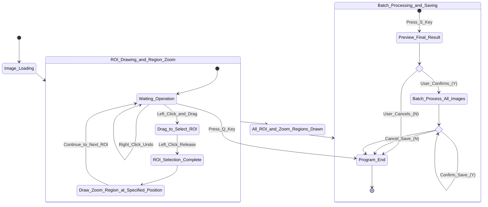
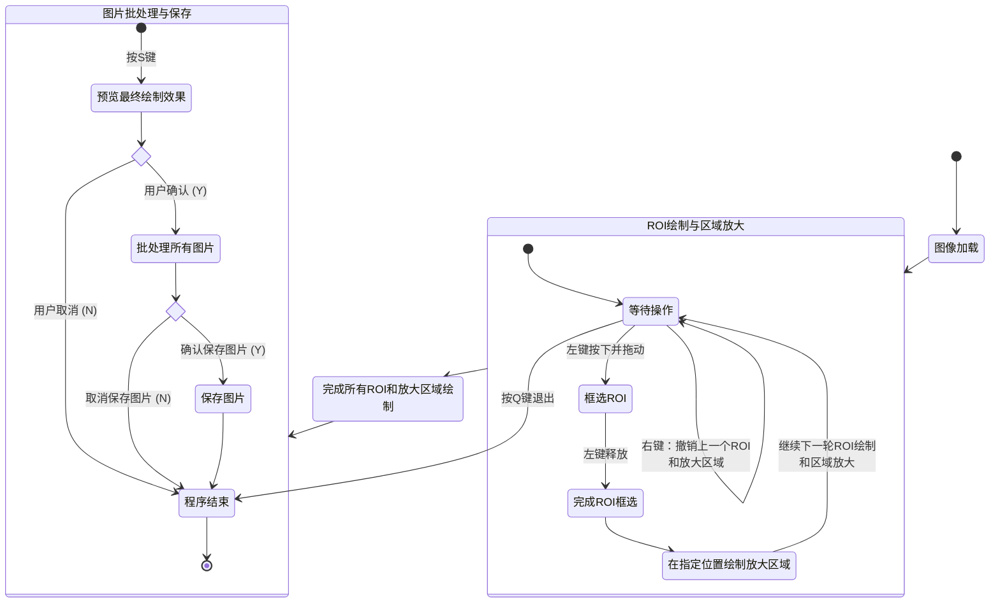
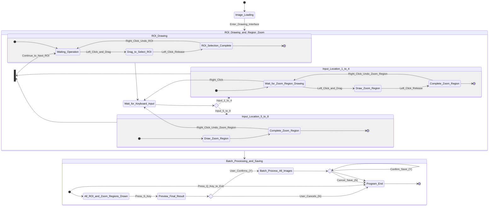
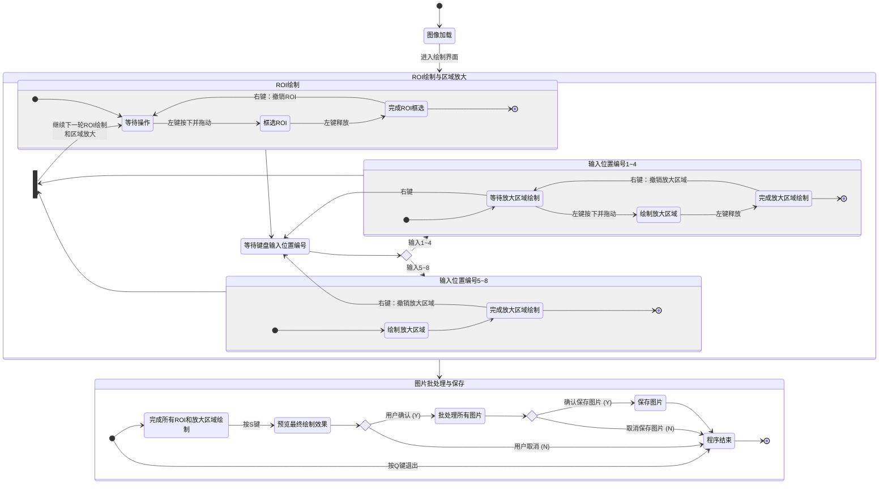

# Batch-MultiROI-Interactive-Zoom-Tool: An interactive zoom tool capable of processing multiple regions of interest (ROIs) across multiple scientific images in batches.

## 📋 Project Overview

This project is specifically designed for handling illustrations in scientific papers and technical reports, enabling the efficient and convenient generation of images with magnified views of specific regions (**ROI**). Through an interactive interface, users can apply magnification effects to any key detail area (ROI) in individual or batch images, intelligently position them within the image, and ultimately produce professional-quality images tailored to scientific research needs.

> This tool includes two core versions, both of which support **batch processing of all images in a folder**, with no limit on the number of images:
> - **[ROI_zoom.py](code/ROI_zoom.py)(Preset Parameters Version)**: Pre-set the **position, size, and color** of the magnified area via code, making it suitable for scenarios requiring precise and consistent output results.
> - **[ROI_zoom2.py](code/ROI_zoom2.py)(Interactive Enhanced Edition)**:** Control the position and size of the magnified area entirely through mouse and keyboard interactions**; simply preset the **color** for more intuitive and flexible operation.

---

## 📁 Project Structure

<details open>
<summary><b>Core Files and Directories</b></summary>

<br/>

```
Batch-MultiROI-Interactive-Zoom-Tool/
├── 📂 code/
│   ├── 📄 ROI_zoom.py              # Version 1: Preset Parameters Version
│   └── 📄 ROI_zoom2.py             # Version 2: Enhanced Interaction Edition
├── 📂 demo/                    # Other materials (including screen recordings with narration)
├── 📂 状态图说明/                # State diagrams for the two versions of the code (including Mermaid code and some additional notes)
├── 📂 示例图像/                 # Store all demonstration images (including the input and output image sets for both code examples)
├── 📂 视频说明/                 # Feature Overview and Demo Videos
├── 📄 README.md                # Chinese Documentation
└── 📄 README_en.md             # English Documentation
```

</details>

---

## ✨ Features

-   🧩 **Flexible Local Zoom**: Supports selecting **any number** of regions of interest (ROIs) on a single image for zooming, overcoming the limitations of single-point zooming.
-   ⚡  **Efficient batch processing**: Process **all images** in a specified folder with a single click, with no limit on the number of files, greatly improving efficiency when handling sets of experimental images or comparison images.
-   🎮 **Two-Version Workflow**: Offers two versions—**parameter preset (`ROI_zoom.py`)** and **fully interactive (`ROI_zoom2.py`)**—to meet the needs of “precise drawing” and “flexible, exploratory” workflows, respectively.
-   🎨 **Custom Border Styles**: Supports **custom border colors** for each ROI box and zoom area box (configured via a list of BGR values), providing clear visual contrast for easy differentiation.
-   📐 **Smart Layout and Aspect Ratio Preservation**: **Supports 8 preset positions for the magnified area (4 corners [top-left/bottom-left/top-right/bottom-right] + 4 edges [top/bottom/left/right]), and automatically preserves the aspect ratio of the original ROI to ensure the magnified content remains distortion-free.**
-   🖼️ **High-quality output**: By default, the software uses the **bilinear interpolation** algorithm for image enlargement, **effectively eliminating jagged edges and ensuring that enlarged details remain clear, smooth, and natural**.
-   🖱️ **Intuitive User Experience**: Perform all operations using mouse drag-and-drop and keyboard shortcuts, with real-time previews and batch saving capabilities.

---

## 🔄 Core Version Notes

Both versions share core features such as **batch processing, support for multiple ROIs, eight different layout options for magnification regions, and aspect ratio locking**; the fundamental difference lies in **how magnification regions (location, size, etc.) are configured**:

| **Characteristic Dimensions**  |                                                                                                                      **`ROI_zoom.py`(Preset Version)**                                                                                                                      |                                                                                 **`ROI_zoom2.py`(Interactive Enhanced Edition)**                                                                                 |
|:------------------------------:|:---------------------------------------------------------------------------------------------------------------------------------------------------------------------------------------------------------------------------------------------------------------------------:|:----------------------------------------------------------------------------------------------------------------------------------------------------------------------------------------------------------------:|
| **Zoom-to-area drawing mode**  |                                                                                                                    **Set specific parameters via code**                                                                                                                     |                                                                                **Draw in real time using the mouse and keyboard**                                                                                |
|        **Key Features**        | <div align="left">1. Edit the `colormap` list (**border colors**) in the code <br>2. Edit the `preset_params` list to preset the following for each ROI: <br>**position code** (1–8), **relative size** (e.g., 0.25), **reference axis** (True: width, False: height)</div> | Simply specify `colormap` (**border color**) and `num_rois` (**number of ROIs**) in the code; **the position, size, and other parameters are determined at runtime through user interaction via the interface**. |
| **Human-Computer Interaction** |                                                                                                                  Use the mouse to **select the ROI area**                                                                                                                   |  **Interactive process: Select the ROI area with the mouse → Use the number keys (1–8) to choose the magnification location → Drag the mouse to adjust the size of the magnified area (for corner locations)**   |
|      **Output Features**       |                                                          **High predictability**: The enlargement results for all images are strictly defined by preset parameters, ensuring consistent and reproducible outcomes.                                                          |                                        **Flexible**: Relies on real-time user interaction, making it ideal for exploring the best layout; results may vary with each run.                                        |
|         **Core Idea**          |                                                                               **Parameterization and Automation**: Configure once to generate a batch of images with a consistent style.                                                                                    |                                                             **Visual and interactive**: Make adjustments as you go and directly control the results.                                                             |

### 📈 How should I choose?
- **Select `ROI_zoom.py`**: Use this when you need to process **a large number of similar images** and want to keep the **position and scale** of the zoom area fixed.
- **Select `ROI_zoom2.py`**: When you need to process **a large number of similar images** and want **intuitive, flexible control over the zoom effect**.

---

## 🔧 Install

Make sure Python is installed, then use pip to install the required libraries:

```bash
pip install opencv-python numpy pillow
```

---

## 🚀 User Guide

### 1. Parameter Settings

<details open>
<summary><b>ROI_zoom.py (Preset Version)</b></summary>

<br/>

Open `ROI_zoom.py`, navigate to the `if __name__ == ‘__main__’:` section at the bottom of the file, and modify the following settings:

```python
input_folder = r"F:\你的输入图片文件夹路径" # Input image folder
output_folder = r"F:\你的输出图片文件夹路径" # Output image folder
is_saved = True  # Save results?

# Color list (B, G, R): Assign colors to each ROI box in order (if there are fewer than 5 regions, use the first few colors; if there are more, cycle through colors 0–4)
colormap = [(255, 255, 0), (0, 255, 0), (0, 0, 255),
        (255, 0, 0), (255, 0, 255)]

# [Core] List of preset parameters: Each tuple defines a set of ROI scaling rules
# Format: (position code, relative size, whether dimensions are based on width)
# Position codes: 1=top-left, 2=top-right, 3=bottom-left, 4=bottom-right, 5=top edge, 6=bottom edge, 7=left edge, 8=right edge
preset_params = [
    (1, 0.25, True),  # ROI 1: Place it in the top-left corner, with a size equal to 25% of the original image's width
    (6, 1.0, False),  # ROI 2: Place it on the bottom edge (full coverage)
]
```

</details>

<details open>
<summary><b>ROI_zoom2.py (Interactive Enhanced Edition)</b></summary>

<br/>

Open the `ROI_zoom2.py` file, navigate to the `if __name__ == “__main__”:` section at the bottom of the file, and modify the following settings:

```python
input_folder = r"F:\你的输入图片文件夹路径" # Input image folder
output_folder = r"F:\你的输出图片文件夹路径" # Output image folder
num_rois = 2  # The number of ROIs selected on each image
is_saved = True # Save results?

# Color list; the program will use these colors in sequence to draw the ROI boxes (if there are fewer than 5 regions of interest, it will use the first few colors; if there are more, it will cycle through colors 0–4)
colormap = [(0, 0, 255), (0, 255, 0), (0, 0, 255),
        (255, 0, 0), (255, 0, 255)]
```

</details>

### 2. Run the program

```bash
# Run the Preset Version
python code/ROI_zoom.py

# Run the Interactive Enhanced Edition
python code/ROI_zoom2.py
```

---

### 3. Human-Computer Interaction

#### **3.1 ROI_zoom.py (Preset Version)**

<br/>

<details open>
<summary><b>🔄 Workflow (State Diagram)</b></summary>

<br/>

> **English**



<br/>

> **Chinese**



</details>

<br/>

<details open>
<summary><b>🖱️ Procedure</b></summary>

<br/>

> 1.  **Image Loading**: The program launches and loads the first image from the input folder.
> 2.  **ROI Selection and Zoom (Core Interaction Loop)**:
>    *   **Select ROI**: **Hold down the left mouse button and drag** on the image to select the rectangular area to be zoomed in on; release the left button to complete the selection.
>    *   **Automatically Generate Zoom Area**: After selecting the ROI, the program will **automatically generate the corresponding zoom area** at the specified location (corner or edge) based on the preset values in `preset_params`.
>    *   **Continue**: After setting an ROI and its corresponding zoom area, the program automatically proceeds to the next drawing cycle.
>    *   **Undo**: You can click the **right mouse button** at any time during the main interaction loop; doing so will **simultaneously undo the previous set of ROIs and zoom regions**.
>    *   **Exit Program**: During the main interaction loop, press the **Q** key to exit the program directly.
> 3. **Batch Processing**:
>    *   After setting all ROIs and zoom regions, press the **S** key to preview the final result.
>    *   Confirm in the terminal whether to apply the settings from the first image to **all images** (**Y** or **N**).

</details>

<br/>

<details open>
<summary><b>⌨️ Keyboard shortcuts</b></summary>

<br/>

|       **Button**        |                                            **Function**                                            |                   **Use Cases**                    |
|:-----------------------:|:--------------------------------------------------------------------------------------------------:|:--------------------------------------------------:|
| **Left-click and drag** |                                        **Select ROI area**                                         |             Core interaction operation             |
|     **Right-click**     |                  **Simultaneously undo the previous ROI and zoom in on the area**                  |              Back during interaction               |
|          **S**          | Complete settings for the first image and proceed to **batch processing preview** and confirmation | Complete interaction, prepare for batch processing |
|          **Y**          |                Confirm application of the first image's settings to **all images**                 |                Batch process images                |
|          **N**          |    Cancel applying the settings from the first image to **all images** and **exit the program**    |    Cancel batch processing and exit the program    |
|          **Q**          |                                        **Exit the program**                                        |  Exit the program from the main interaction loop   |

</details>

---

#### **3.2 ROI_zoom2.py (Interactive Enhanced Edition)**

<br/>

<details open>
<summary><b>🔄 Workflow (State Diagram)</b></summary>

<br/>

> **English**



<br/>

> **Chinese**



</details>

<br/>

<details open>
<summary><b>🖱️ Procedure</b></summary>

<br/>

> 1.  **Image Loading**: The program launches and loads the first image from the input folder.
> 2.  **ROI Selection and Zoom (Core Interaction Loop)**:
>    *   **Select ROI**: **Hold down the left mouse button and drag** on the image to select the rectangular area you want to zoom in on; release the left button to complete the selection.
>    *   **Select Zoom Position**: Following the terminal prompt, press one of the numeric keys **1–8** on the keyboard to select the position for the zoomed area.
>    *   **Adjust Zoomed Area**:
>        *   If the position is a **corner (1–4)**: Use that corner as a fixed point, **hold down the left mouse button and drag** to adjust the size of the zoom box (the program automatically maintains the aspect ratio).
>        *   If the position is a **edge (5–8)**: The program automatically generates a zoom area that fills the corresponding edge.
>    *   **Continue**: After setting up an ROI and its corresponding zoom area, the program automatically proceeds to the next drawing cycle.
>    *   **Undo**: Within the main interaction loop, you can click the **right mouse button** at any time to undo the previous operation (**such as undoing an ROI, returning to position selection, or undoing a zoom area**).
>    *   **Exit Program**: Within the main interaction loop, press the **Q** key to exit the program directly.
> 3.  **Batch Processing**:
>    *   After setting all ROIs and zoom regions, press the **S** key to preview the final result.
>    *   Confirm in the terminal whether to apply the settings from the first image to **all images** (**Y** or **N**).

</details>

<br/>

<details open>
<summary><b>⌨️ Keyboard shortcuts</b></summary>

<br/>

|       **Button**        |                                                                                    **Function**                                                                                     |                   **Use Cases**                    |
|:-----------------------:|:-----------------------------------------------------------------------------------------------------------------------------------------------------------------------------------:|:--------------------------------------------------:|
| **Left-click and drag** |                                                         **Select ROI area** or **adjust zoom area size (when in a corner)**                                                         |             Core interaction operation             |
|     **Right-click**     |                                                                              **Undo previous action**                                                                               |              Back during interaction               |
|    **Num keys 1–8**     | Select the **placement position** of the zoom area <br/> (**1: Top-left, 2: Top-right, 3: Bottom-left, 4: Bottom-right, 5: Top edge, 6: Bottom edge, 7: Left edge, 8: Right edge**) |               Set zoom area position               |
|          **S**          |                                         Complete settings for the first image and proceed to **batch processing preview** and confirmation                                          | Complete interaction, prepare for batch processing |
|          **Y**          |                                                            Confirm applying the first image's settings to **all images**                                                            |                Batch process images                |
|          **N**          |                                            Cancel applying the settings from the first image to **all images** and **exit the program**                                             |    Cancel batch processing and exit the program    |
|          **Q**          |                                                                                **Exit the program**                                                                                 |  Exit the program from the main interaction loop   |

</details>


### 4. Save Output

> If an image in the input folder is named **Fig_1.png**, the corresponding output file in the output folder will be named **enhanced_Fig_1.png**.

---

## 📸 Results

The following are examples of the actual processing results from `ROI_zoom2.py` (Interactive Enhanced Version) in the **Batch-MultiROI-Interactive-Zoom-Tool**, which clearly demonstrate the tool’s ability to add zoomed-in regions to images in the paper.

| **Processing Status** |                                                                                         **model1**                                                                                         |                                                                                             **model2**                                                                                              |                                                                                               **model3**                                                                                                |
|:---------------------:|:------------------------------------------------------------------------------------------------------------------------------------------------------------------------------------------:|:---------------------------------------------------------------------------------------------------------------------------------------------------------------------------------------------------:|:-------------------------------------------------------------------------------------------------------------------------------------------------------------------------------------------------------:|
| **Before processing** |         <a href="./示例图像/ROI_zoom2/输入/TMT.jpg" target="_blank"></a>          |          <a href="./示例图像/ROI_zoom2/输入/TMT_ASF.jpg" target="_blank"></a>          |          <a href="./示例图像/ROI_zoom2/输入/TMT_Mamba.jpg" target="_blank"></a>          |
| **After processing**  | <a href="./示例图像/ROI_zoom2/输出/enhanced_TMT.jpg" target="_blank"></a> | <a href="./示例图像/ROI_zoom2/输出/enhanced_TMT_ASF.jpg" target="_blank"></a> | <a href="./示例图像/ROI_zoom2/输出/enhanced_TMT_Mamba.jpg" target="_blank"></a> |

> **Table Description**: This table presents a side-by-side comparison of “**Before Processing**” and “**After Processing**” to demonstrate the tool’s batch processing results for **output images from three different models within the same research context**.
> In this table, the first row (**Before processing**) shows the original input image; the second row (**After processing**) shows the image with annotations indicating the magnified regions.

---

## 🎥 Video Commentary

### 🎥 Full explanatory video

A complete video walkthrough of this project (including a more detailed comparison of features and usage instructions): [多张图片局部区域批量放大.mp4](视频说明/多张图片局部区域批量放大.mp4)。

> Since the full tutorial video is larger than 10 MB, it cannot be displayed directly on GitHub. You can access it using the following methods:
> <br/>**1. Download from GitHub**
> <br/>**2. Contact the author**
> <br/><b>QQ Email: </b>3524345723@qq.com

---

The following two videos provide **partial demonstrations** of **ROI_zoom.py (preset parameters version)** and **ROI_zoom2.py (interactive enhanced version)** (focusing solely on human-computer interaction and demonstration effects; parameter settings are not included).

<details open>
<summary><b>📹 How to Use ROI_zoom.py (Preset Version)?</b></summary>

<br/>

> This video demonstrates **some of the workflow steps** for the preset version: **automated batch processing of images by interactively selecting regions of interest (ROIs)**.


https://github.com/user-attachments/assets/bbac7d7d-2303-45d2-a60a-cccf3cf8a784


</details>

<br/>

<details open>
<summary><b>📹 How to Use ROI_zoom2.py (Interactive Enhanced Edition)?</b></summary>

<br/>

> This video demonstrates **some of the workflow steps** in the interactive enhanced version, including **selecting the region of interest (ROI) with the mouse,** **using the numeric keys on the keyboard to select the location of the magnified area,** and **real-time adjustment of the magnified area's size (limited to corner positions)**.


https://github.com/user-attachments/assets/7b2a34cd-f456-46aa-877e-ddf03bb90d39


</details>

---

### ❓ Other issues

**Q1: What are the requirements for images during batch processing?**<br/>
**A1: Both versions support processing any number of images, but the images in the input folder must be the same size.**<br/>

**Q2: In `ROI_zoom2.py`, is there a “drag resistance” when adjusting the size of the zoom area (i.e., the aspect ratio of the zoom box cannot be set to arbitrary values)? **<br/>
**A2: This is normal. The program automatically maintains the aspect ratio of the original ROI; when dragging, changing one dimension automatically adjusts the other to ensure the zoomed-in content remains undistorted.**<br/>

**Q3: During user interaction, the program displays the error `ZeroDivisionError: division by zero`!**<br/>
**A3: Please do not simply click the left mouse button when drawing an ROI (as this involves aspect ratio calculations); instead, hold down the left mouse button and drag to draw the ROI.**<br/>

**Q4: Why do multiple ROIs and zoom region bounding boxes appear with the same color in the processed image?**<br/>
**A4: This occurs because the number of ROI groups exceeds the number of colors in the preset `colormap`. If `colormap` is set to `None`, both versions of the program will use the default 5 colors. When the number of ROIs exceeds the number of colors, the program cycles through the color list using modulo arithmetic (`color = colors[i % len(colors)]`), resulting in color repetition. **<br/>
**Recommendation: When configuring, ensure that the number of colors in the `colormap` list is at least equal to the number of ROI groups.**

**Q5: Is the line width drawn by both versions fixed?**<br/>
**A5: Yes, it is a fixed value. If you wish to change the line width, please modify the code yourself.**<br/>

---

## 🙏 Acknowledgments

We would like to thank the following open-source projects for their inspiration and guidance:
- https://github.com/LeoMengTCM/Leo-ROI-Zoom-Tool
- https://github.com/wyhlaowang/MagniPatch
- https://github.com/Vaeeeee-WJ/PlotBuddy
- https://github.com/JuewenPeng/Image_Local_Magnification_Tool
